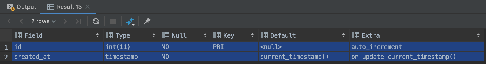
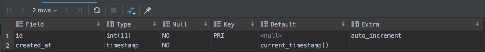

# Maria DB timestamp 타입 컬럼 이슈

mariaDB를 사용하면 timestamp 컬럼을 이용할때가 있다.
첫번째 timestamp 컬럼에 자동으로 on update CURRENT_TIMESTAMP() 조건이 붙는다.
하지만 해당 조건이 필요없는 컬럼이 있을 수가 있다.
해당 원인과 ON UPDATE 조건 없애는 방법을 정리했습니다.
 
 - 테스트 테이블 생성
```mariadb
CREATE TABLE time_stamp_test (
    id int NOT NULL AUTO_INCREMENT,
    created_at timestamp NOT NULL,
    CONSTRAINT time_stamp_test_pk PRIMARY KEY (id)
);
```

 - 테이블 구성 확인
```mariadb
DESC time_stamp_test;
```

 - 결과값


 - created_at 컬럼 ON UPDATE 설정 제외
```mariadb
ALTER TABLE time_stamp_test
    CHANGE COLUMN created_at created_at TIMESTAMP NOT NULL DEFAULT CURRENT_TIMESTAMP;
```

 - 테이블 구성 확인
```mariadb
DESC time_stamp_test;
```

 - 결과값


 - 원인 : 아래 참조자료 링크에도 적혀 있지만, 
 timestamp 컬럼의 첫번째 레코드는 반드시 ON UPDATE CURRENT_TIMESTAMP() 설정이로 자동으로 되어 있다.
 
참조자료
- [mariaDB](https://mariadb.com/kb/en/timestamp/) 