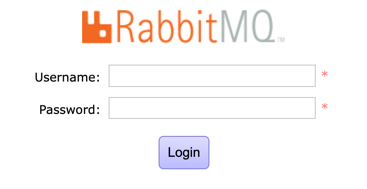

# RabbitMQ Docker 설치

# docker-compose 방식 설치 
- 이미지별 차이점
  - management : 매니지먼트 툴이 있음
  - alpine : 가벼운버전 용량이 적음

```yaml
version: '3.7'

services:
  rabbitmq:
    image: 'rabbitmq:3.6.10-management-alpine' 
    container_name: rabbitmq
    volumes:
      - ./.docker/rabbitmq/etc/:/etc/rabbitmq/
      - ./.docker/rabbitmq/data/:/var/lib/rabbitmq/
      - ./.docker/rabbitmq/logs/:/var/log/rabbitmq/
    ports:
      - "5672:5672"
      - "15672:15672"
    environment:
      RABBITMQ_ERLANG_COOKIE: "RabbitMQ-My-Cookies" #Ealang Cookie 설정 (클러스터 구축시 필요)
      RABBITMQ_DEFAULT_USER: "root" #admin password
      RABBITMQ_DEFAULT_PASS: "root" #admin password
```

```shell
$ docker-compose up -d
```

---
하지만 왜인지 management 경로 ```localhost:15672```  에 들어가지지 않아서 compose 방식 포기.
기존에 설치된 container 와 image 정보 삭제 후. docker run 방식으로 재실행

```shell
$ docker run -d -p 15672:15672 -p 5672:5672 --name rabbitmq -e RABBITMQ_DEFAULT_USER=root -e RABBITMQ_DEFAULT_PASS=root rabbitmq:3.6.10-management-alpine
```

위와같이 다시 실행시키니 정상적으로 ```localhost:15672``` 매니지먼트 경로에 접근 가능.



---
출처 : https://hub.docker.com/_/rabbitmq