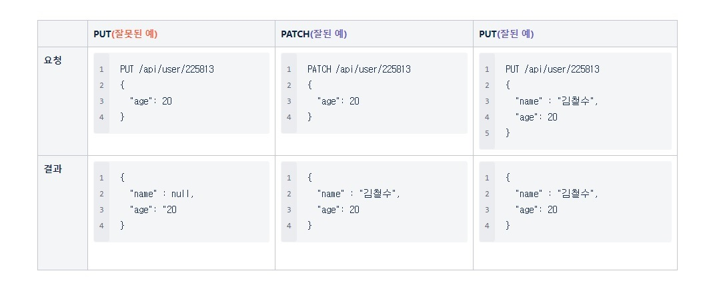

# HTTP Method 중 PUT 과 PATCH 의 차이

- PUT : 자원의 전체 교체, 자원내 모든 필드영역 필요 (만약 일부만 전달 할 경우, 그 외의 필드 모두 null or 초기값 처리)

- PATCH : 자원의 부분 교체, 자원 내 일부 필드영역 필요


```
{ //기존 데이터
  "name" : "김철수", // 이름
  "age": 18 // 나이
}
```




참조 사이트 : https://papababo.tistory.com/269