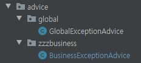

# SpringProject @ControllerAdvice 순서 (@Order Annotation)

 - Spring Rest API 에서 CustomException 을 사용 할 때가 있을것이다.(예시)
    - 예를들어 전체 Exception 을 잡기 위한 GlobalExceptionAdvice 이 있고,
    - 비지니스 로직상에서 예상할 수 있는 RuntimeException 을 처리하기 위한 BusinessExceptionAdvice 로 지정 한다.
    - 전체 코드는 [YongSu-Farm-Api](https://github.com/zzaisang/YoungSu-Farm-api) 에 있습니다 :)
 - Custom ExceptionAdvice 예시 (Exception 처리)
 ```java
@Slf4j
@ControllerAdvice
public class GlobalExceptionAdvice {

    @ExceptionHandler(Exception.class)
    public ResponseEntity<ApiResult> globalExceptionHandler(Exception e) {
        log.error("{}",e);
        final HttpStatus httpStatus = getHttpStatusByException(e);
        final Code code = Code.BAD_REQUEST.equals(httpStatus) ? Code.BAD_REQUEST : Code.ERROR;
        final ApiResult apiResult = ApiResult.builder()
                .httpStatus(httpStatus)
                .code(code)
                .message(e.getMessage())
                .timestamp(System.currentTimeMillis())
                .build();

        return new ResponseEntity<>(apiResult,httpStatus);
    }
    private HttpStatus getHttpStatusByException(Exception e) {
        if (e instanceof IllegalArgumentException || e instanceof IllegalStateException) {
            return HttpStatus.BAD_REQUEST;
        } else
            return HttpStatus.INTERNAL_SERVER_ERROR;
    }
}
```
 - Custom BusinessExceptionAdvice 예시
 ```java
@Slf4j
@ControllerAdvice
public class BusinessExceptionAdvice {
    @ExceptionHandler(BusinessException.class)
    public ResponseEntity<ApiResult> BusinessExceptionHandler(BusinessException e) {
        log.error("{}", e);
        return ApiResult.fail(e.getCode(),e.getMessage()).createResponseEntity();
    }
}
```
- Custom BusinessException 예시 (RuntimeException 처리)
```java
@Getter @Setter
public class BusinessException extends RuntimeException{

    private Code code;

    public BusinessException(){}

    public BusinessException(Code code) {
        super(code.getDefaultMessageCode());
        this.code = code;
    }
    public BusinessException(Code code,String message) {
        super(message);
        this.code = code;
    }
}
```
 - Advice 패키지 위치
   - 

### Debugging
 - 테스트를 진행하기위해 테스트용 Controller 를 작성한다.
 ```java
@RestController
@RequestMapping("/v1/exception")
public class ExceptionTestController {

    @GetMapping
    public ResponseEntity test(){

        if(1 == 1) throw new BusinessException(Code.BAD_REQUEST,"크크크 테스트입니다.");

        return ApiResult.fail(Code.BAD_REQUEST).createResponseEntity();
    }
}
 ```
 - IntelliJ 의 REST Client 를 이용하여 해당 경로를 호출.(다른방법을 사용하여도 무관.)
 - CustomExceptionAdvice 가 제대로 동작을 하기위해서는 ExceptionHandlerExceptionResolver.getExceptionHandlerMethod() 에 브레이크 포인트를 걸고 확인한다.
 - 
 - 위 사진처럼 this 내에 exceptionHandlerAdviceCache 에 기존에 Advice 로 등록한 두가지 ExceptionAdvice 가 보인다.
 - BusinessException(RuntimeException) 보다 GlobalException(Exception) 이 더 상위개념이다. -> RuntimeException 이 Exception 을 상속 받기 때문.
### 패키지 명 때문에 Advice 순서가 달라질 경우
 - 만약 패키지가 하위 사진 처럼 구성 되어 있을때, 
 - 
 - @Order 지정을 안해줄 경우 내림차순으로 advice 들을 담게된다. ControllerAdviceBean 내 findAnnotatedBeans 매서드를 보면 @ControllerAdvice 이 선언된 클래스들을 정의한다.
 - 
 - 이런 경우에 BusinessException 으로 예외 처리해야 하는데 GlobalException 에서 예외처리를 하는 경우가 생긴다.
 - 하지만 BusinessExceptionAdvice 에 @order(순번) 을 정해주면 order 순번에 따라서 sorting 을 해주기 때문에 상위 ExceptionAdvice 가 잡힐 일 이 없어진다.
 ```java
@Slf4j
@ControllerAdvice
@Order(1)
public class BusinessExceptionAdvice {
    @ExceptionHandler(BusinessException.class)
    public ResponseEntity<ApiResult> BusinessExceptionHandler(BusinessException e) {
        log.error("{}", e);
        return ApiResult.fail(e.getCode(),e.getMessage()).createResponseEntity();
    }
}
 ```

도움주신분 : nespot2
