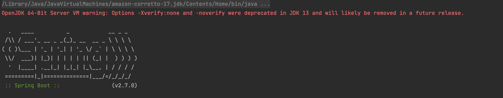
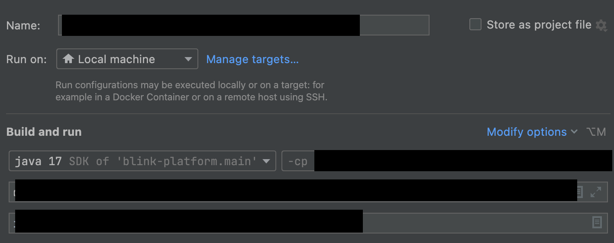

# OpenJDK_VM_Warning 제거하기

## OpenJDK 64-Bit Server VM warning: Options -Xverify:none and -noverify were deprecated in JDK 13 and will likely be removed in a future release.

## 프로젝트 환경 
- Java17 (Amazon Corretto JDK version 17)
- Spring boot 2.7.0
- IntelliJ 2021.3.2

***

- 하위 사진 처럼 Spring Boot 프로젝트 실행시 빨간색으로 경고가 뜨는경우가 있다 (불편) 

- Intellij 에서 SpringBoot 실행시 Option 정보가 JDK13 이후로 제거될 가능성이 있다고 하는 경고창.

### 해결 방법

1. Edit configurations (프로젝트 설정 창) 클릭
2.  해당 창에서 Modify Options 클릭
3. 'Disable Launch Optimization' 설정 추가 
4. Apply 및 OK 

- 체크해제한 옵션은 애플리케이션의 실행속도를 높힐수 있으며 JVM 옵션에 -XX:TieredStopAtLevel=1 와 -noverify 가 추가된다고 한다

--- 
출처 : https://kim-jong-hyun.tistory.com/121