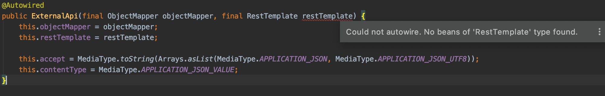

# Spring RestTemplate 설정하기.(Bean 등록하기)

- 현재 버전 : Spring Boot 2.1.7.RELEASE
- BackEnd 에서 외부로 API 호출을 하기 위해 RestTemplate 를 많이 사용한다.
하지만 RestTemplate 사용하기 위해서는 Bean 등록을 해줘야한다.
- Bean 등록이 안되었을때 뜨는 "Could not autowire. No beans of 'RestTemplate' type found." 오류


---
##### 해결 방법
* 제일 기본적인 방법.
 
```java
    @Configuration
    public class RestTemplateConfiguration {
    
        @Bean
        public RestTemplate restTemplate() {
            return new RestTemplate();
        }
    
    }
```
* 읽기시간,연결 초과시간 추가 버전.
```java
@Configuration
public class RestTemplateConfiguration {

    @Value("${api.read-time-out:5000}")
    private int readTimeOut;

    @Value("${api.connect-time-out:30000}")
    private int connectTimeOut;

    @Bean
    public RestTemplate restTemplate() {
        HttpComponentsClientHttpRequestFactory factory = new HttpComponentsClientHttpRequestFactory();
        factory.setReadTimeout(readTimeOut); // 읽기시간초과, ms
        factory.setConnectTimeout(connectTimeOut); // 연결시간초과, ms
        return new RestTemplate(factory);
    }
}
```

* DB ConnectionPool 처럼 Http Connection Pool 설정 추가 버전.
    * build.gradle 에 라이브러리 추가. (Groovy가 아닌 KotlinDsl 입니다.)
    ```kotlin
      implementation("org.apache.httpcomponents:httpclient:4.5.10")
    ```
    ```java
  @Configuration
  public class RestTemplateConfiguration {
  
      @Bean
      public RestTemplate restTemplate() {
  
          final CloseableHttpClient httpClient = HttpClients
                  .custom()
                  .setMaxConnTotal(120)
                  .setMaxConnPerRoute(60)
                  .build();
          final HttpComponentsClientHttpRequestFactory factory = new HttpComponentsClientHttpRequestFactory(httpClient);
          factory.setConnectTimeout(300);
          factory.setReadTimeout(300);
          return new RestTemplate(factory);
      }
  
  }
    ```


    