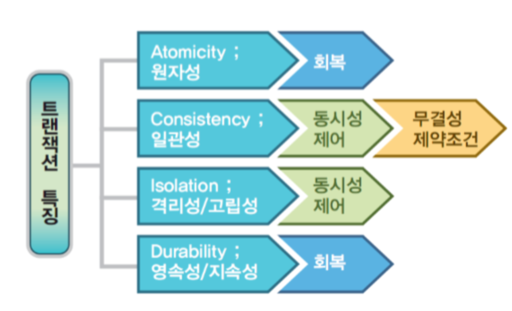
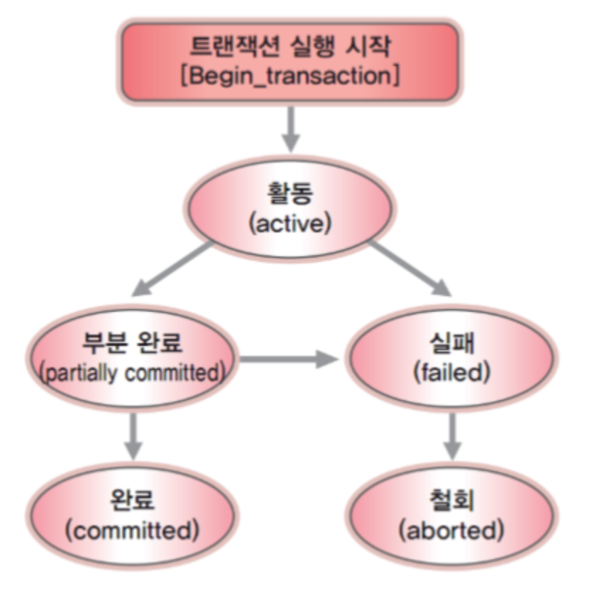

# 트랜잭션과 ACID

트랜잭션은 작업수행의 논리적 단위, query를 하나의 묶음으로 처리해서 오류가 생기면 Rollback하고 오류가 없으면 commit을 하는  즉 한 묶음의 query가 전부 다 수행되거나 수행되지 않는 작업수행의 논리적 단위

트랜잭션을 사용하는 이유는 데이터 정합성을 위해서입니다. 병렬성을 유지하면서도 데이터의 정합성이 깨지지 않게 하기 위해 이런 논리적 단위를 사용합니다.

트랜잭션의 4가지 특성으로는 ACID 가 있습니다.

## A 원자성 (Atomicity)
- 트랜잭션의 작업이 부분적으로 실행되거나 중단되지 않는 것을 보장하는 것
- All or Nothing의 개념으로 작업 단위의 일부만 실행하지 않는다는 것을 의미

## C 일관성 (Consistency)
- 트랜잭션이 성공적으로 완료되면 일관적인 DB 상태를 유지하는 것을 의미
- 여기서 말하는 일관성이란 데이터 속성 유지, A에서 B로 계좌를 이체하면 총량은 같아야 하는 등이 있다.

## I 격리성,고립성(Isolation)
- 트랜잭션 수행 시 다른 트랜잭션의 작업이 끼어들지 못하도록 보장하는 것
- 트랜잭션 끼리는 상호간의 존재를 모르고 독립적으로 수행되어야 한다.

## D 지속성, 영속성 (Durability)
- 성공적으로 수행된 트랜잭션은 영원히 반영이 되어야 한다.
- 즉 장애발생 후에도 변함 없이 보관되어야 한다는 것

---
# 트랜잭션과 DBMS 
- DBMS는 원자성을 유지하기 위해 회복(복구)관리자 프로그램을 작동시킴.
- DBMS는 일관성을 유지하기 위해 동시성 제어 알고리즘과 무결성 제약조건을 활용함.
- DBMS는 고립성을 유지하기 위해 동시성 제어 알고리즘을 작동시킴
- DBMS는 지속성을 유지하기 위해 회복 관리자 프로그램을 이용함

## 기타 개념들
- 롤백(Rollback) : 트랜잭션이 행한 모든 연산을 취소시키거나 트랜잭션을 재시작함
- DBMS는 일관성을 유지하기 위해 무결성 제약조건을 활용함.
- DBMS는 고립성을 유지하기 위해 동시성 제어 알고리즘을 작동시킴.
- DBMS는 지속성을 유지하기 위해 회복 관리자 프로그램을 이용함.
- 

---
출처 : https://mangkyu.tistory.com/30, https://victorydntmd.tistory.com/129