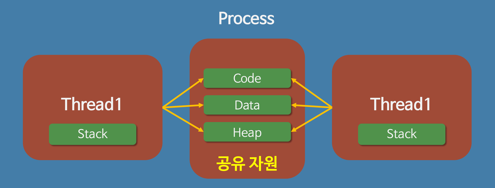

# MultiProcessAndMultiThread
## 멀티 프로세스 대신 멀티 스레드를 사용하는 이유

---

- 쉽게 설명하면, 프로그램을 여러개 키는것보다 하나의 프로그램 안에서 여러 작업을 해결하는 것이다.

## 1. 자원의 효율성 증대

- 멀티 프로세스로 실행되는 작업을 멀티 스레드로 실행할 경우, 프로세스를 생성하여 자원을 할당하는 시스템 콜이 줄어들어 자원을 효율적으로 관리할 수 있다.
  - 프로세스간에 Context Switching 시 단순히 CPU 레지스터 교체뿐만아니라 RAM과 CPU 사이의 캐시 메모리에 대한 데이터까지 초기화되므로 오버헤드가 크기때문
- 스레드는 프로세스 내의 메모리를 공유하기 때문에 독립적인 프로세스와 달리 스레드 간 데이터를 주고 받는 것이 간단해지고 시스템 자원 소모가 줄어들게 된다.

## 2. 처리 비용 감소 및 응답 시간 단축

- 또한 프로세스 간의 통신 (IPC)보다 스레드 간의 통신의 비용이 적으므로 작업들 간의 통신의 부담이 줄어든다.
  - 스레드는 Stack 영역을 제외한 모든 메모리를 공유하기 때문
- 프로세스 간의 전환 속도보다 스레드 간의 전환 속도가 빠르다.
  - Context Switching 시 스레드는 Stack 영역만 처리하기 때문

- 주의할 점!
  - 동기화 문제
    - 스레드간의 자원 굥유는 전역 변수(데이터 세그먼트)를 이용하므로 함께 사용할 때 충돌이 발생할 수 있다.

---
출처 : https://github.com/WeareSoft/tech-interview/blob/master/contents/os.md#%EB%A9%80%ED%8B%B0-%ED%94%84%EB%A1%9C%EC%84%B8%EC%8A%A4-%EB%8C%80%EC%8B%A0-%EB%A9%80%ED%8B%B0-%EC%8A%A4%EB%A0%88%EB%93%9C%EB%A5%BC-%EC%82%AC%EC%9A%A9%ED%95%98%EB%8A%94-%EC%9D%B4%EC%9C%A0