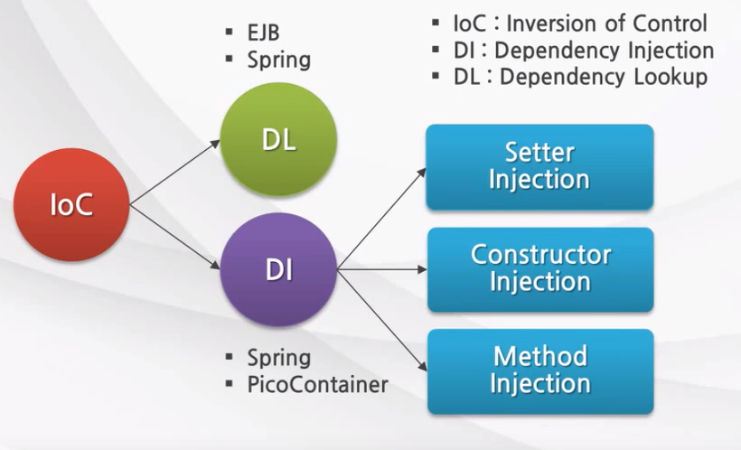
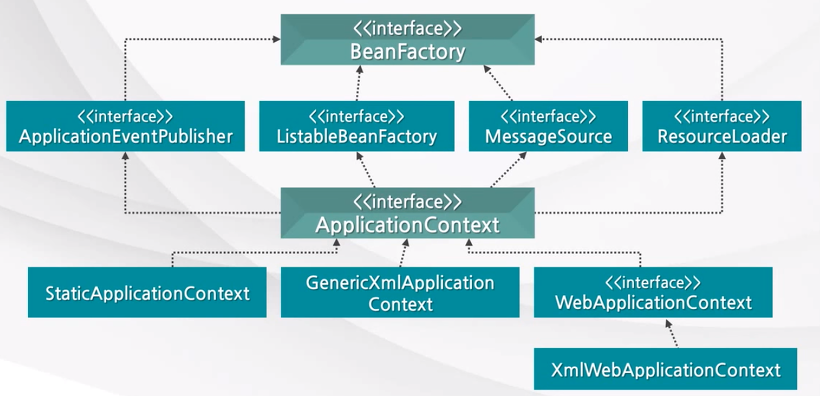

# Spring IoC Container

# IoC (Inversion of Control)
- IoC  사전적 의미는 '제어반전'을 뜻하고 있습니다.
- IoC(제어 반전)이란, 객체의 생성, 생명주기의 관리까지 모든 객체에 대한 제어권이 바뀌었다는 것을 의미합니다.
- 컴포넌트 의존관계 설정(Component dependency resolution), 설정(Configuration) 및 생명주기(LifeCycle)을 해결하기 위한 디자인 패턴(Design Pattern)입니다.

---
## IoC 컨테이너

스프링 프레임워크도 객체를 생성하고 관리하고 책임지고 의존성을 관리해주는 컨테이너가 있는데, 그것이 바로 IoC 컨테이너(=스프링 컨테이너)입니다.

인스턴스 생성부터 소멸까지 인스턴스 생명주기 관리를 개발자가 아닌 컨테이너가 대신 해줍니다.  
객체관리 주체가 프레임워크(Container)가 되기 때문에 개발자는 로직에 집중할 수 있는 장점이 있습니다.

- IoC 컨테이너는 객체의 생성을 책임지고, 의존성을 관리한다.
- POJO의 생성,초기화,서비스,소멸에 대한 권한을 가진다.
- 개발자들이 직접 POJO를 생성할 수 있지만 컨터이너에게 맡긴다.
- 개발자는 비지니스 로직에 집중할 수 있다.
- 객체 생성 코드가 없으므로 TDD가 용이하다.

---

## IoC의 분류

### DL(Dependency Lookup) 과 DI (Dependency Injection)

- DL : 저장소에 저장되어 있는 Bean에 접근하기 위해 컨터에너가 제공하는 API를 이용하여 Bean을 Lookup 하는 것
- DI : 각 클래스간의 의존관계를 빈 설정 (Bean Definition) 정보를 바탕으로 컨테이너가 자동으로 연결해주는 것
  - Setter Injection (수정자 주입)
  - Constructor Injection (생성자 주입)
  - Method Injection (필드 주입)

DL 사용시 컨테이너 종속이 증가하기 때문에 주로 DI를 사용합니다.

---

##스프링 컨테이너 (IoC 컨테이너)의 종류
스프링 컨테이너가 관리하는 객체를 빈(Bean)이라고 하고,  
이 빈들을 관리한다는 의미로 컨테이너를 빈 팩토리(Bean Factory) 라고 부릅니다.
- 객체의 생성과 객체 사이의 런타임 관계를 DI 관점에서 볼 때 컨테이너를 BeanFactory 라고 한다.
- BeanFacotry 에 여러가지 컨테이너 기능을 추가한 어플리케이션컨텍스트(ApplicationContext)가 있다.

### BeanFactory 와 ApplicationContext

**Bean Factory**
- BeanFactory 계열의 인터페이스만 구현한 클래스는 단순히 컨테이너에서 객체를 생성하고 DI 를 처리하는 기능만 제공한다.
- Bean을 등록,생성,조회,반환 관리를 한다.
- 팩토리 디자인 패턴을 구현한 것으로 BeanFactory는 빈을 생성하고 분해하는 책임을 지는 클래스이다.
- Bean을 조회할 수 있는 getBean()메소드가 정의되어 있다.
- 보통은 BeanFactory를 바로 사용하지 않고, 이를 확장한 ApplicationContext를 사용한다.

**ApplicationContext**
- Bean을 등록,생성,조회,반환 관리하는 기능은 BeanFactory와 같다.
- 스프링의 각종 부가기능을 추가로 제공한다.
- BeanFactory 보다 더 추가적으로 제공하는 기능
  - 국제화가 지원되는 텍스트 메시지를 관리해준다.
  - 이미지 같은 파일 자원을 로드할 수 있는 포괄적인 방법을 제공해준다.
  - 리스너로 등록된 빈에게 이벤트 발생을 알려준다.

따라서 대부분의 어플리케이션에서는 빈팩토리 보다는 어플리케이션콘텍스트를 사용하는 것이 더 좋습니다.
