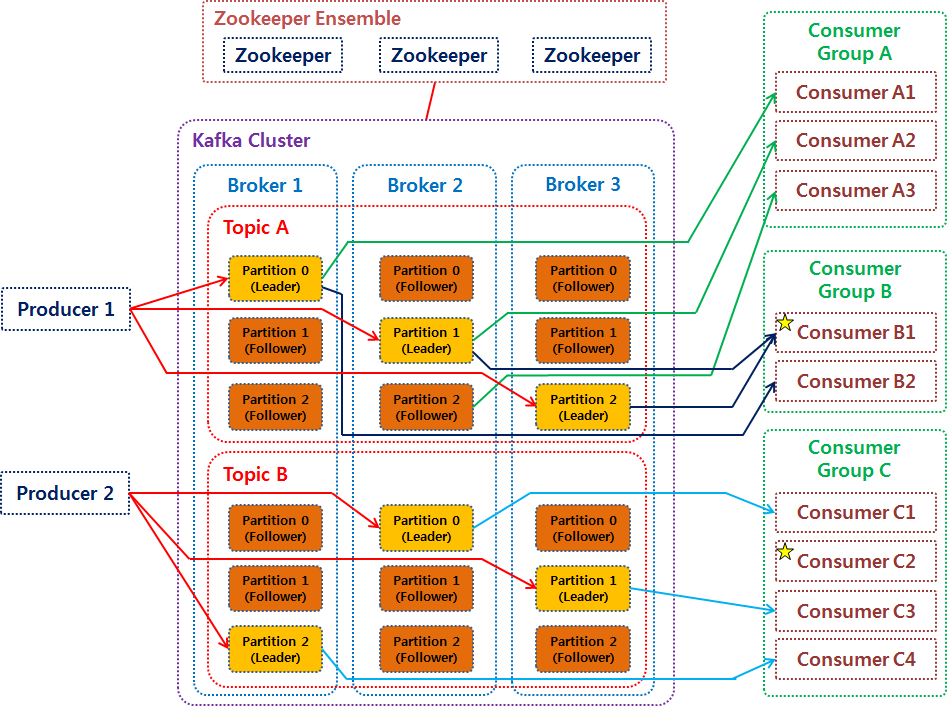

# kafka 이론

# 카프카의 특징 
- Pub/Sub 동작 방식이다.
  - Publisher와 Subscriber가 독립적으로 데이터를 생산하고 소비한다. 프로듀서와 컴포넌트를 디커플링하기 위한 좋은 수단이다.
  - 이런 느슨한 결합을 통해 둘 중 하나가 죽어도 서로간에 의존성이 없으므로 안정적으로 데이터를 처리할 수 있다.
    - 리시버와 컬렉터의 통신을 API로 한다고 가정
      - 컬렉터는 리시버가 요청한 것을 바로 처리해줘야한다. (처리를 미룰 수 없다.)
      - 실패가 났을 때 부분 재처리가 불가능하다.
      - 처리속도가 느린 컴포넌트 기준으로 처리량이 결정된다. 그러므로 트래필이 몰리는 상황을 대비해 전체 파이프라인을 넉넉하게 산정해야한다.
    - 중간에 카프카를 두게 되면 이런게 좋아진다.
      - 컬렉터는 리시버가 요청한 작업을 쌓아두고 나중에 처리할 수 있다.
      - 실패가 나도 컬렉터만 따로 재처리 할 수 있다.
      - 일시적으로 트래픽이 몰리는 상황을 대비해서 제일 프론트의 서버만 넉넉하게 준비해두면 된다. 물론 장기적으로 되면 파이프라인 증설이 필요.
    - 또한 설정 역시 간단해진다.
      - Publisher 따로, Subscriber 따로 독립적으로 설정할 수 있다.
- 디스크 순차 저장 및 처리
  - 메세지를 메모리큐에 적재하면 데이터 손실 가능성이 있지만 카프카는 디스크에 쓰므로 데이터 손실 걱정이 없다.
  - 디스크에 쓰므로 상대적으로 속도가 느리지만, 순차처리 방식으로 디스크 I/O를 줄여 그렇게 느리지 않다. 엄청 높은 반응성이 필요한 서비스가 아니라면 속도가 문제되지 않는다.

- 데이터를 가져오기(Consume) / 내보내기(Produce) 를 포함하여 이벤트 스트림을 게시 (쓰기) 및 구독 (읽기) 합니다.

# 용어 정리
- Producer : 스트림을 Publish, 브로커에 메세지를 보내는 애플리케이션
- Consumer : 스트림을 subscribe, 브로커에 메세지를 취득하는 애플리케이션
- Kafka Cluster 
  - Broker : 하나의 카프카 서버를 지칭
    - Topic : 카프카에 저장된 메세지는 topic 으로 분류
      - Partition : 브로커 상의 메세지를 **물리적으로 분할하는 단위**
        - Leader : Producer 로 부터 전달된 메세지를 보관
        - Flower : Producer 로 부터 전달된 메세지를 복제하여 보관
- Zookeeper : 브로커에 분산처리를 위한 관리도구, 카프카 브로커를 하나의 클러스터로 코디네이팅